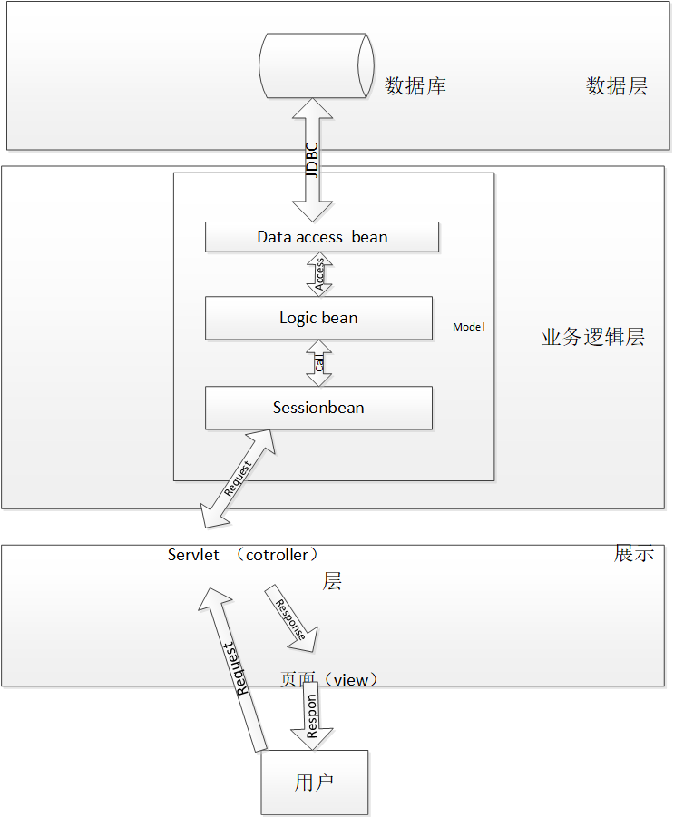

## Web应用架构
***
基于MVC模式的三层架构, 业务逻辑层由logic bean , data access , session bean构成

### session bean
提供了面向展示层的统一的业务逻辑调用接口，所有事务都由会话外观进行管理

### logic bean
可以直接被会话外观调用, 实现会话外观所需的业务逻辑; 可以被其他logic Bean调用

### data access
提供了数据层的访问接口, 通常采取单个数据表对应单个数据存取 Bean 的映射方式, 由单个数据存取 Bean 包含对应单个数据表的所有相关数据访问操作

### 交互流程
用户请求输入用户表示层, 业务逻辑层接受从表示层输入将其转化为业务逻辑过程能够理解的方式, 根据特定的业务逻辑有序地向数据层发送数据请求, 并将数据层返回的数据解释及组合成用户所需信息, 返回给表示层  

