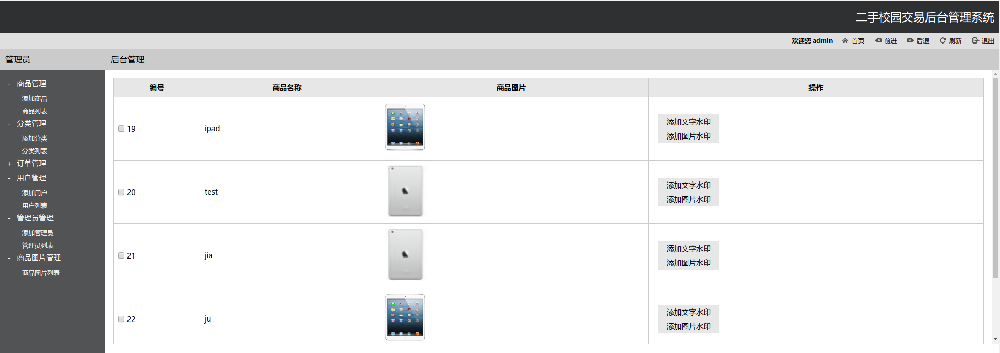

## Web 应用构建和部署
***
### Web 应用构建工具
* 开发工具: PhpStorm
* 开发语言: Php
* 开发环境: Ubuntu 16.04 LTS
* 数据库: MySQL

### Web 应用界面
* 客户端  
    * 首页 
    

    * 登录、注册  
    
    

* 服务端
    * 首页  
     
    * 登录  
     

### Web 功能界面
* 添加分类  

* 添加商品  

* 添加用户

* 添加管理员

* 浏览商品图片
